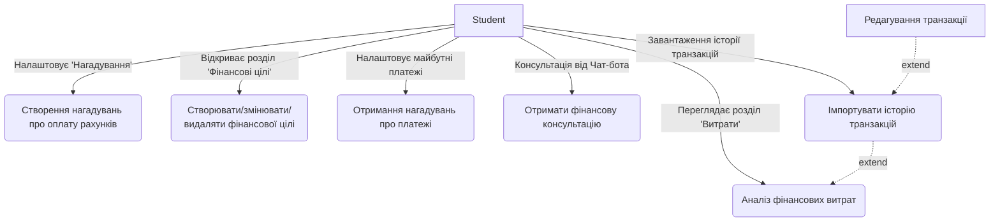

```mermaid

graph TD;

    A[Student] -->|Переглядає розділ 'Витрати'| B(Аналіз фінансових витрат);
    A[Student] -->|Налаштовує 'Нагадування'| C(Створення нагадувань про оплату рахунків);
    A[Student] -->|Відкриває розділ 'Фінансові цілі'| D(Створювати/змінювати/видаляти фінансової цілі);
    A[Student] -->|Налаштовує майбутні платежі| E(Отримання нагадувань про платежі);
    A[Student] -->|Консультація від Чат-бота| F(Отримати фінансову консультацію);
    A[Student] -->|Завантаження історії транзакцій| G(Імпортувати історію транзакцій);
    H[Редагування транзакції]-.-> |extend|G;
    G -.->|extend| B

```

