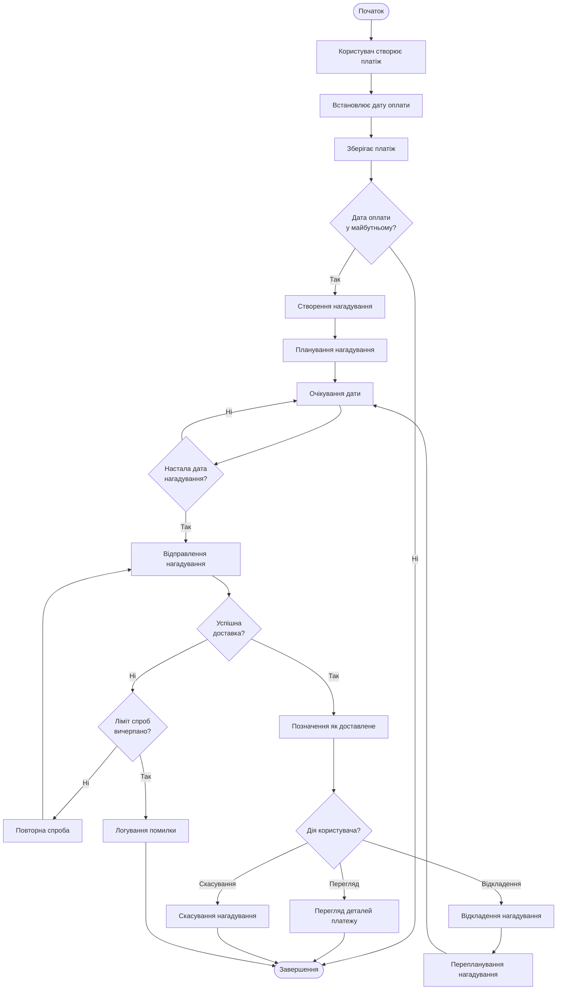

```mermaid
flowchart TD
    Start([Початок]) --> CreatePayment[Користувач створює платіж]
    CreatePayment --> SetDueDate[Встановлює дату оплати]
    SetDueDate --> SavePayment[Зберігає платіж]
    
    SavePayment --> DueDate{Дата оплати\nу майбутньому?}
    DueDate -->|Так| CreateNotification[Створення нагадування]
    DueDate -->|Ні| End([Завершення])
    
    CreateNotification --> ScheduleNotification[Планування нагадування]
    ScheduleNotification --> WaitForDate[Очікування дати]
    
    WaitForDate --> CheckDueDate{Настала дата\nнагадування?}
    CheckDueDate -->|Ні| WaitForDate
    CheckDueDate -->|Так| SendNotification[Відправлення нагадування]
    
    SendNotification --> DeliveryStatus{Успішна\nдоставка?}
    DeliveryStatus -->|Так| MarkDelivered[Позначення як доставлене]
    DeliveryStatus -->|Ні| RetryCount{Ліміт спроб\nвичерпано?}
    
    RetryCount -->|Ні| RetryDelivery[Повторна спроба]
    RetryDelivery --> SendNotification
    RetryCount -->|Так| LogError[Логування помилки]
    
    MarkDelivered --> UserAction{Дія користувача?}
    UserAction -->|Перегляд| ViewNotification[Перегляд деталей платежу]
    UserAction -->|Скасування| CancelNotification[Скасування нагадування]
    UserAction -->|Відкладення| SnoozeNotification[Відкладення нагадування]
    
    ViewNotification --> End
    CancelNotification --> End
    SnoozeNotification --> RescheduleNotification[Перепланування нагадування]
    RescheduleNotification --> WaitForDate
    
    LogError --> End
```
