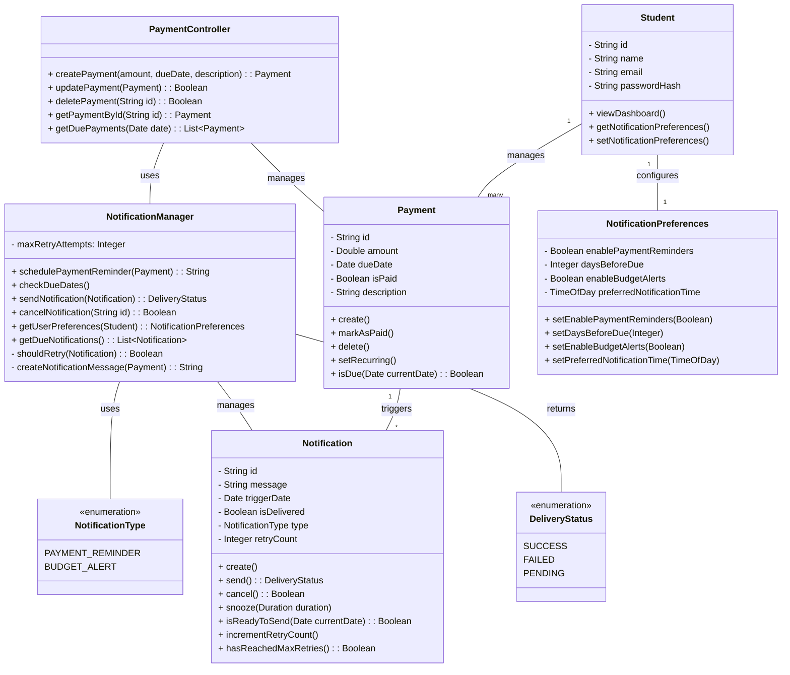

```mermaid
classDiagram
    %% Entity classes
    class Student {
        - String id
        - String name
        - String email
        - String passwordHash
        + viewDashboard()
        + getNotificationPreferences()
        + setNotificationPreferences()
    }

    class Payment {
        - String id
        - Double amount
        - Date dueDate
        - Boolean isPaid
        - String description
        + create()
        + markAsPaid()
        + delete()
        + setRecurring()
        + isDue(Date currentDate): Boolean
    }

    class Notification {
        - String id
        - String message
        - Date triggerDate
        - Boolean isDelivered
        - NotificationType type
        - Integer retryCount
        + create()
        + send(): DeliveryStatus
        + cancel(): Boolean
        + snooze(Duration duration)
        + isReadyToSend(Date currentDate): Boolean
        + incrementRetryCount()
        + hasReachedMaxRetries(): Boolean
    }

    class NotificationType {
        <<enumeration>>
        PAYMENT_REMINDER
        BUDGET_ALERT
    }

    class DeliveryStatus {
        <<enumeration>>
        SUCCESS
        FAILED
        PENDING
    }

    class PaymentController {
        + createPayment(amount, dueDate, description): Payment
        + updatePayment(Payment): Boolean
        + deletePayment(String id): Boolean
        + getPaymentById(String id): Payment
        + getDuePayments(Date date): List~Payment~
    }

    class NotificationManager {
        - maxRetryAttempts: Integer
        + schedulePaymentReminder(Payment): String
        + checkDueDates()
        + sendNotification(Notification): DeliveryStatus
        + cancelNotification(String id): Boolean
        + getUserPreferences(Student): NotificationPreferences
        + getDueNotifications(): List~Notification~
        - shouldRetry(Notification): Boolean
        - createNotificationMessage(Payment): String
    }

    class NotificationPreferences {
        - Boolean enablePaymentReminders
        - Integer daysBeforeDue
        - Boolean enableBudgetAlerts
        - TimeOfDay preferredNotificationTime
        + setEnablePaymentReminders(Boolean)
        + setDaysBeforeDue(Integer)
        + setEnableBudgetAlerts(Boolean)
        + setPreferredNotificationTime(TimeOfDay)
    }

    %% Relationships
    Student "1" -- "many" Payment : manages
    Student "1" -- "1" NotificationPreferences : configures
    Payment "1" -- "*" Notification : triggers
    NotificationManager -- NotificationType : uses
    NotificationManager -- DeliveryStatus : returns
    NotificationManager -- Notification : manages
    PaymentController -- Payment : manages
    PaymentController -- NotificationManager : uses
```
