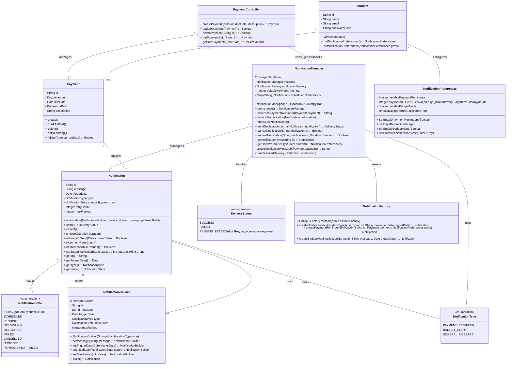

```mermaid
classDiagram
    %% Entity classes
    class Student {
        - String id
        - String name
        - String email
        - String passwordHash
        + viewDashboard()
        + getNotificationPreferences(): NotificationPreferences
        + setNotificationPreferences(NotificationPreferences prefs)
    }
    class Payment {
        - String id
        - Double amount
        - Date dueDate
        - Boolean isPaid
        - String description
        + create()
        + markAsPaid()
        + delete()
        + setRecurring()
        + isDue(Date currentDate): Boolean
    }

    class Notification {
        - String id
        - String message
        - Date triggerDate
        - NotificationType type
        - NotificationState state  // Додано стан
        - Integer retryCount
        - Integer maxRetries
        + Notification(NotificationBuilder builder) // Конструктор приймає Builder
        + send(): DeliveryStatus
        + cancel()
        + snooze(Duration duration)
        + isReadyToSend(Date currentDate): Boolean
        + incrementRetryCount()
        + hasReachedMaxRetries(): Boolean
        + setState(NotificationState state) // Метод для зміни стану
        + getId(): String
        + getTriggerDate(): Date
        + getType(): NotificationType
        + getState(): NotificationState
    }

    Notification --|> NotificationBuilder : uses

    class NotificationBuilder { // Патерн Builder
        - String id
        - String message
        - Date triggerDate
        - NotificationType type
        - NotificationState initialState
        - Integer maxRetries
        + NotificationBuilder(String id, NotificationType type)
        + setMessage(String message): NotificationBuilder
        + setTriggerDate(Date triggerDate): NotificationBuilder
        + setInitialState(NotificationState state): NotificationBuilder
        + setMaxRetries(int retries): NotificationBuilder
        + build(): Notification
    }

    class NotificationType {
        <<enumeration>>
        PAYMENT_REMINDER
        BUDGET_ALERT
        GENERAL_MESSAGE
    }

    class NotificationState { // Енам для стану сповіщення
        <<enumeration>>
        SCHEDULED
        PENDING
        DELIVERING
        DELIVERED
        FAILED
        CANCELLED
        SNOOZED
        PERMANENTLY_FAILED
    }

    class DeliveryStatus {
        <<enumeration>>
        SUCCESS
        FAILED
        PENDING_EXTERNAL // Якщо відправка асинхронна
    }

    class PaymentController {
        + createPayment(amount, dueDate, description): Payment
        + updatePayment(Payment): Boolean
        + deletePayment(String id): Boolean
        + getPaymentById(String id): Payment
        + getDuePayments(Date date): List~Payment~
    }

    class NotificationManager { // Патерн Singleton
        - NotificationManager instance
        - NotificationFactory notificationFactory
        - Integer defaultMaxRetryAttempts
        - Map~String, Notification~ scheduledNotifications
        - NotificationManager() // Приватний конструктор
        + getInstance(): NotificationManager
        + schedulePaymentReminder(Payment payment): String
        + scheduleNotification(Notification notification)
        + checkDueNotifications()
        + sendNotificationInternal(Notification notification): DeliveryStatus
        + cancelNotification(String notificationId): Boolean
        + snoozeNotification(String notificationId, Duration duration): Boolean
        + getNotificationById(String id): Notification
        + getUserPreferences(Student student): NotificationPreferences
        - createNotificationMessage(Payment payment): String
        - handleFailedDelivery(Notification notification)
    }

    class NotificationFactory { // Патерн Factory Method (або Abstract Factory)
        + createNotification(NotificationType type, String id, String message, Date triggerDate): Notification
        + createPaymentReminderNotification(String id, Payment payment, NotificationPreferences prefs): Notification
        + createBudgetAlertNotification(String id, String message, Date triggerDate): Notification
    }


    class NotificationPreferences {
        - Boolean enablePaymentReminders
        - Integer daysBeforeDue // Скільки днів до дати платежу надсилати нагадування
        - Boolean enableBudgetAlerts
        - TimeOfDay preferredNotificationTime
        + setEnablePaymentReminders(Boolean)
        + setDaysBeforeDue(Integer)
        + setEnableBudgetAlerts(Boolean)
        + setPreferredNotificationTime(TimeOfDay)
    }

    %% Relationships
    Student "1" -- "many" Payment : manages
    Student "1" -- "1" NotificationPreferences : configures

    Payment "1" -- "*" Notification : triggers

    NotificationManager "1" -- "1" NotificationFactory : uses >
    NotificationManager "1" -- "*" Notification : manages >
    NotificationManager -- NotificationType : uses
    NotificationManager -- DeliveryStatus : handles

    PaymentController "1" -- "1" NotificationManager : uses (getInstance) >
    PaymentController "1" -- "*" Payment : manages

    Notification "1" -- "1" NotificationState : has a
    Notification "1" -- "1" NotificationType : has a
    NotificationBuilder ..> Notification : builds
```
