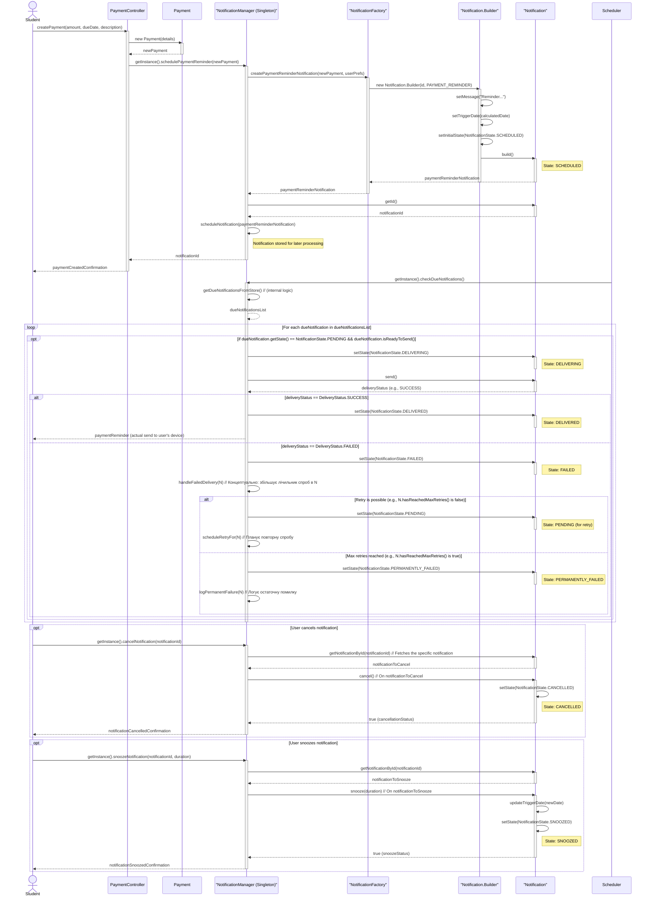

```mermaid
sequenceDiagram
    actor Student
    participant PC as PaymentController
    participant P as Payment
    participant NM as "NotificationManager (Singleton)"
    participant NF as "NotificationFactory"
    participant NB as "Notification.Builder"
    participant N as "Notification"

    Student->>PC: createPayment(amount, dueDate, description)
    activate PC
    PC->>P: new Payment(details)
    activate P
    P-->>PC: newPayment
    deactivate P

    PC->>NM: getInstance().schedulePaymentReminder(newPayment)
    activate NM
    NM->>NF: createPaymentReminderNotification(newPayment, userPrefs)
    activate NF
    NF->>NB: new Notification.Builder(id, PAYMENT_REMINDER)
    activate NB
    NB->>NB: setMessage("Reminder...")
    NB->>NB: setTriggerDate(calculatedDate)
    NB->>NB: setInitialState(NotificationState.SCHEDULED)
    NB->>N: build()
    activate N
    note right of N: State: SCHEDULED
    N-->>NF: paymentReminderNotification
    deactivate N
    deactivate NB
    NF-->>NM: paymentReminderNotification
    deactivate NF

    NM->>N: getId()
    activate N
    N-->>NM: notificationId
    deactivate N

    NM->>NM: scheduleNotification(paymentReminderNotification) # internally stores it
    note right of NM: Notification stored for later processing
    NM-->>PC: notificationId
    deactivate NM

    PC-->>Student: paymentCreatedConfirmation
    deactivate PC

    %% Час проходить ... спрацьовує планувальник
    participant Scheduler
    Scheduler->>NM: getInstance().checkDueNotifications()
    activate NM
    NM->>NM: getDueNotificationsFromStore() // (internal logic)
    NM-->>NM: dueNotificationsList

    loop For each dueNotification in dueNotificationsList
        opt if dueNotification.getState() == NotificationState.PENDING && dueNotification.isReadyToSend()
            NM->>N: setState(NotificationState.DELIVERING)
            activate N
            note right of N: State: DELIVERING
            deactivate N

            NM->>N: send()
            activate N
            N-->>NM: deliveryStatus (e.g., SUCCESS)
            deactivate N

            alt deliveryStatus == DeliveryStatus.SUCCESS
                NM->>N: setState(NotificationState.DELIVERED)
                activate N
                note right of N: State: DELIVERED
                deactivate N
                NM-->>Student: paymentReminder (actual send to user's device)
            else deliveryStatus == DeliveryStatus.FAILED
                NM->>N: setState(NotificationState.FAILED)
                activate N
                note right of N: State: FAILED
                deactivate N
                NM->>NM: handleFailedDelivery(N) // Концептуально: збільшує лічильник спроб в N

                alt Retry is possible (e.g., N.hasReachedMaxRetries() is false)
                     NM->>N: setState(NotificationState.PENDING)
                     activate N
                     note right of N: State: PENDING (for retry)
                     deactivate N
                     NM->>NM: scheduleRetryFor(N) // Планує повторну спробу
                else Max retries reached (e.g., N.hasReachedMaxRetries() is true)
                     NM->>N: setState(NotificationState.PERMANENTLY_FAILED)
                     activate N
                     note right of N: State: PERMANENTLY_FAILED
                     deactivate N
                     NM->>NM: logPermanentFailure(N) // Логує остаточну помилку
                end
            end
        end
    end
    deactivate NM


    %% Альтернативний потік: Скасування сповіщення
    opt User cancels notification
        Student->>NM: getInstance().cancelNotification(notificationId)
        activate NM
        NM->>N: getNotificationById(notificationId) // Fetches the specific notification
        activate N
        N-->>NM: notificationToCancel
        deactivate N

        NM->>N: cancel() // On notificationToCancel
        activate N
        N->>N: setState(NotificationState.CANCELLED)
        note right of N: State: CANCELLED
        N-->>NM: true (cancellationStatus)
        deactivate N
        NM-->>Student: notificationCancelledConfirmation
        deactivate NM
    end

    %% Альтернативний потік: Відкладення сповіщення
    opt User snoozes notification
        Student->>NM: getInstance().snoozeNotification(notificationId, duration)
        activate NM
        NM->>N: getNotificationById(notificationId)
        activate N
        N-->>NM: notificationToSnooze
        deactivate N

        NM->>N: snooze(duration) // On notificationToSnooze
        activate N
        N->>N: updateTriggerDate(newDate)
        N->>N: setState(NotificationState.SNOOZED)
        note right of N: State: SNOOZED
        N-->>NM: true (snoozeStatus)
        deactivate N
        NM-->>Student: notificationSnoozedConfirmation
        deactivate NM
    end
```
