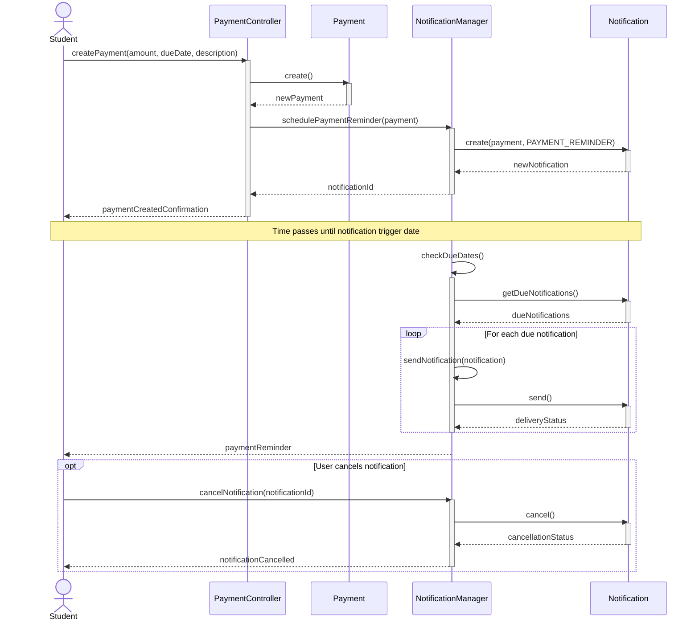

```mermaid
sequenceDiagram
    actor Student
    participant PaymentController
    participant Payment
    participant NotificationManager
    participant Notification
    
    Student->>PaymentController: createPayment(amount, dueDate, description)
    activate PaymentController
    PaymentController->>Payment: create()
    activate Payment
    Payment-->>PaymentController: newPayment
    deactivate Payment
    
    PaymentController->>NotificationManager: schedulePaymentReminder(payment)
    activate NotificationManager
    NotificationManager->>Notification: create(payment, PAYMENT_REMINDER)
    activate Notification
    Notification-->>NotificationManager: newNotification
    deactivate Notification
    NotificationManager-->>PaymentController: notificationId
    deactivate NotificationManager
    
    PaymentController-->>Student: paymentCreatedConfirmation
    deactivate PaymentController
    
    Note over Student,Notification: Time passes until notification trigger date
    
    NotificationManager->>NotificationManager: checkDueDates()
    activate NotificationManager
    NotificationManager->>Notification: getDueNotifications()
    activate Notification
    Notification-->>NotificationManager: dueNotifications
    deactivate Notification
    
    loop For each due notification
        NotificationManager->>NotificationManager: sendNotification(notification)
        NotificationManager->>Notification: send()
        activate Notification
        Notification-->>NotificationManager: deliveryStatus
        deactivate Notification
    end
    deactivate NotificationManager
    
    NotificationManager-->>Student: paymentReminder
    
    opt User cancels notification
        Student->>NotificationManager: cancelNotification(notificationId)
        activate NotificationManager
        NotificationManager->>Notification: cancel()
        activate Notification
        Notification-->>NotificationManager: cancellationStatus
        deactivate Notification
        NotificationManager-->>Student: notificationCancelled
        deactivate NotificationManager
    end
```
