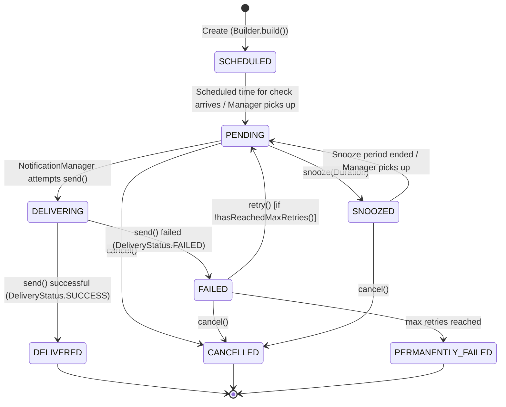

```mermaid
stateDiagram-v2
    [*] --> SCHEDULED: Create (Builder.build())

    SCHEDULED --> PENDING: Scheduled time for check arrives / Manager picks up

    PENDING --> DELIVERING: NotificationManager attempts send()
    PENDING --> CANCELLED: cancel()
    PENDING --> SNOOZED: snooze(Duration)

    DELIVERING --> DELIVERED: send() successful (DeliveryStatus.SUCCESS)
    DELIVERING --> FAILED: send() failed (DeliveryStatus.FAILED)

    FAILED --> PENDING: retry() [if !hasReachedMaxRetries()]
    FAILED --> PERMANENTLY_FAILED: max retries reached
    FAILED --> CANCELLED: cancel()

    SNOOZED --> PENDING: Snooze period ended / Manager picks up
    SNOOZED --> CANCELLED: cancel()

    DELIVERED --> [*]
    CANCELLED --> [*]
    PERMANENTLY_FAILED --> [*]
```
