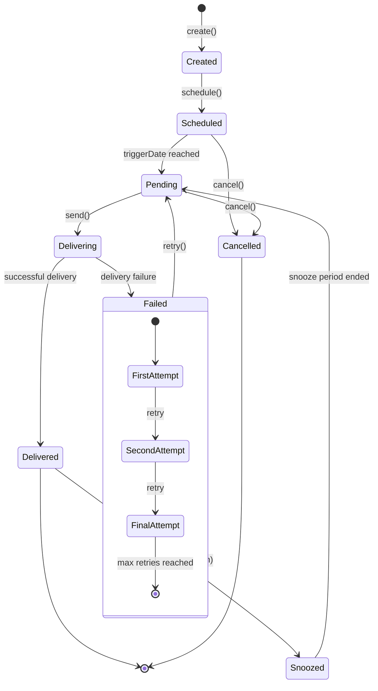

```mermaid
stateDiagram-v2
    [*] --> Created: create()
    Created --> Scheduled: schedule()
    Scheduled --> Pending: triggerDate reached
    Pending --> Delivering: send()
    Delivering --> Delivered: successful delivery
    Delivering --> Failed: delivery failure
    Failed --> Pending: retry()
    
    Scheduled --> Cancelled: cancel()
    Pending --> Cancelled: cancel()
    
    Delivered --> [*]
    Cancelled --> [*]
    
    Delivered --> Snoozed: snooze(Duration)
    Snoozed --> Pending: snooze period ended
    
    state Failed {
        [*] --> FirstAttempt
        FirstAttempt --> SecondAttempt: retry
        SecondAttempt --> FinalAttempt: retry
        FinalAttempt --> [*]: max retries reached
    }
```
