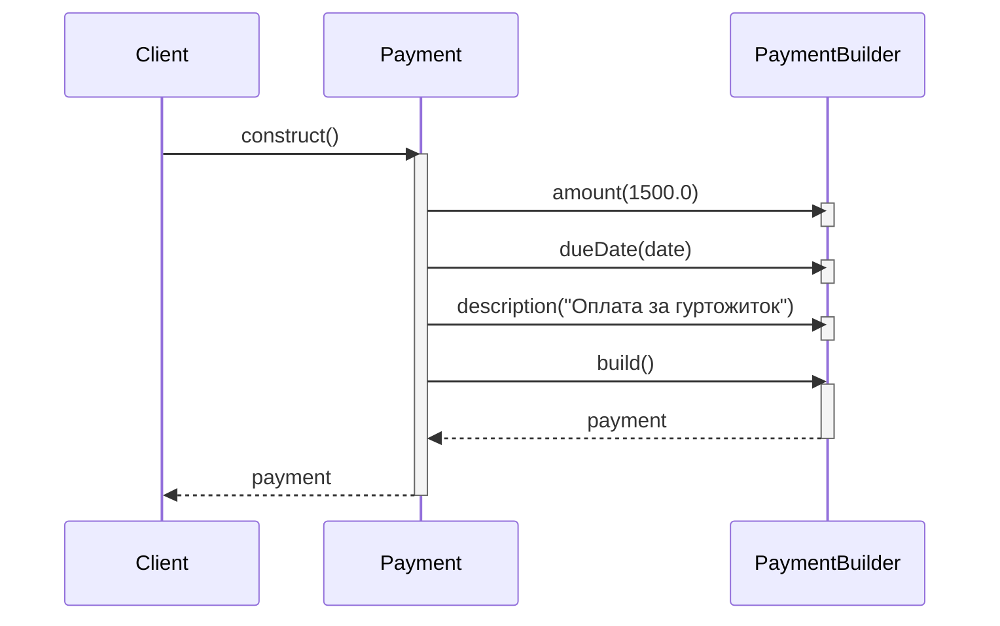

```mermaid
sequenceDiagram
    participant Client 
    participant Payment
    participant PaymentBuilder


    Client->>Payment: construct()
    activate Payment
    Payment->>PaymentBuilder: amount(1500.0)
    activate PaymentBuilder
    deactivate PaymentBuilder

    Payment->>PaymentBuilder: dueDate(date)
    activate PaymentBuilder
    deactivate PaymentBuilder

    Payment->>PaymentBuilder: description("Оплата за гуртожиток")
    activate PaymentBuilder
    deactivate PaymentBuilder

    Payment->>PaymentBuilder: build()
    activate PaymentBuilder
    
    PaymentBuilder -->> Payment: payment
    deactivate PaymentBuilder
    Payment-->>Client: payment
    deactivate Payment
```