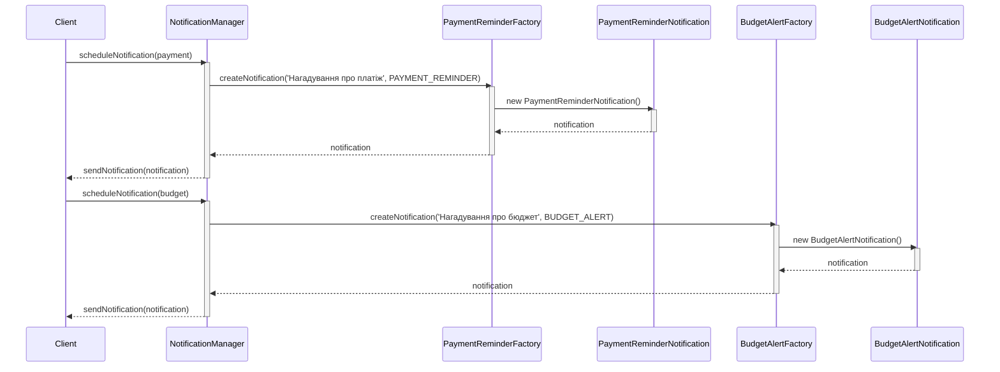

```mermaid
sequenceDiagram
    participant Client
    participant NotificationManager
    participant PaymentReminderFactory
    participant PaymentReminderNotification
    participant BudgetAlertFactory
    participant BudgetAlertNotification
    
    Client ->> NotificationManager : scheduleNotification(payment)
    activate NotificationManager

    NotificationManager ->> PaymentReminderFactory : createNotification('Нагадування про платіж', PAYMENT_REMINDER)
    activate PaymentReminderFactory
    
    PaymentReminderFactory ->> PaymentReminderNotification : new PaymentReminderNotification()
    activate PaymentReminderNotification
    
    PaymentReminderNotification -->> PaymentReminderFactory : notification
    deactivate PaymentReminderNotification
    
    PaymentReminderFactory -->> NotificationManager : notification
    deactivate PaymentReminderFactory

    NotificationManager -->> Client : sendNotification(notification)
    deactivate NotificationManager


    Client->> NotificationManager: scheduleNotification(budget)
    activate NotificationManager

    NotificationManager ->> BudgetAlertFactory : createNotification('Нагадування про бюджет', BUDGET_ALERT)
    activate BudgetAlertFactory

    BudgetAlertFactory ->> BudgetAlertNotification : new BudgetAlertNotification()
    activate BudgetAlertNotification

    BudgetAlertNotification -->> BudgetAlertFactory : notification
    deactivate BudgetAlertNotification

    BudgetAlertFactory -->> NotificationManager : notification
    deactivate BudgetAlertFactory

    NotificationManager -->> Client : sendNotification(notification)
    deactivate NotificationManager


```