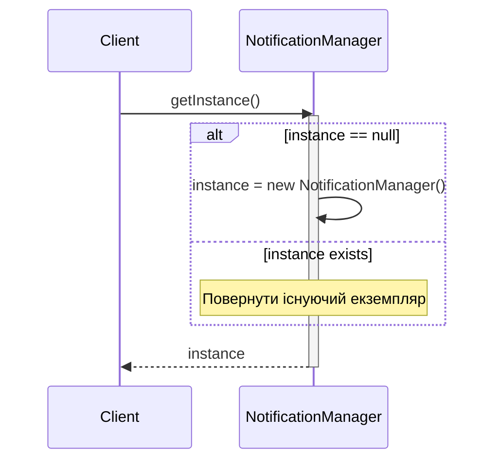

```mermaid
sequenceDiagram
    participant Client
    participant NotificationManager
    
    Client->>NotificationManager: getInstance()
    activate NotificationManager
    
    alt instance == null
        NotificationManager->>NotificationManager: instance = new NotificationManager()
        else instance exists
            Note over NotificationManager: Повернути існуючий екземпляр
    end
    
    NotificationManager-->>Client: instance
    deactivate NotificationManager

```