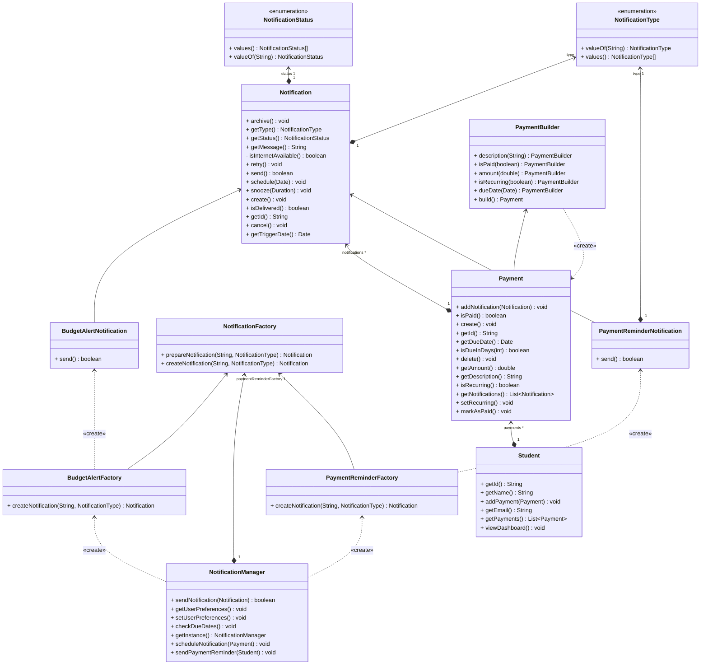

```mermaid
classDiagram
    direction BT
    class BudgetAlertFactory {
        + createNotification(String, NotificationType) Notification
    }
    class BudgetAlertNotification {
        + send() boolean
    }
    class Notification {
        + archive() void
        + getType() NotificationType
        + getStatus() NotificationStatus
        + getMessage() String
        - isInternetAvailable() boolean
        + retry() void
        + send() boolean
        + schedule(Date) void
        + snooze(Duration) void
        + create() void
        + isDelivered() boolean
        + getId() String
        + cancel() void
        + getTriggerDate() Date
    }
    class NotificationFactory {
        + prepareNotification(String, NotificationType) Notification
        + createNotification(String, NotificationType) Notification
    }
    class NotificationManager {
        + sendNotification(Notification) boolean
        + getUserPreferences() void
        + setUserPreferences() void
        + checkDueDates() void
        + getInstance() NotificationManager
        + scheduleNotification(Payment) void
        + sendPaymentReminder(Student) void
    }
    class NotificationStatus {
        <<enumeration>>
        + values() NotificationStatus[]
        + valueOf(String) NotificationStatus
    }
    class NotificationType {
        <<enumeration>>
        + valueOf(String) NotificationType
        + values() NotificationType[]
    }
    class Payment {
        + addNotification(Notification) void
        + isPaid() boolean
        + create() void
        + getId() String
        + getDueDate() Date
        + isDueInDays(int) boolean
        + delete() void
        + getAmount() double
        + getDescription() String
        + isRecurring() boolean
        + getNotifications() List~Notification~
        + setRecurring() void
        + markAsPaid() void
    }
    class PaymentBuilder {
        + description(String) PaymentBuilder
        + isPaid(boolean) PaymentBuilder
        + amount(double) PaymentBuilder
        + isRecurring(boolean) PaymentBuilder
        + dueDate(Date) PaymentBuilder
        + build() Payment
    }
    class PaymentReminderFactory {
        + createNotification(String, NotificationType) Notification
    }
    class PaymentReminderNotification {
        + send() boolean
    }
    class Student {
        + getId() String
        + getName() String
        + addPayment(Payment) void
        + getEmail() String
        + getPayments() List~Payment~
        + viewDashboard() void
    }

    BudgetAlertFactory  ..>  BudgetAlertNotification : «create»
    BudgetAlertFactory  -->  NotificationFactory
    BudgetAlertNotification  -->  Notification
    Notification "1" *--> "status 1" NotificationStatus
    Notification "1" *--> "type 1" NotificationType
    NotificationManager  ..>  BudgetAlertFactory : «create»
    NotificationManager "1" *--> "paymentReminderFactory 1" NotificationFactory
    NotificationManager  ..>  PaymentReminderFactory : «create»
    Payment "1" *--> "notifications *" Notification
    Payment  -->  PaymentBuilder
    PaymentBuilder  ..>  Payment : «create»
    PaymentReminderFactory  -->  NotificationFactory
    PaymentReminderFactory  ..>  PaymentReminderNotification : «create»
    PaymentReminderNotification  -->  Notification
    PaymentReminderNotification "1" *--> "type 1" NotificationType
    Student "1" *--> "payments *" Payment

```