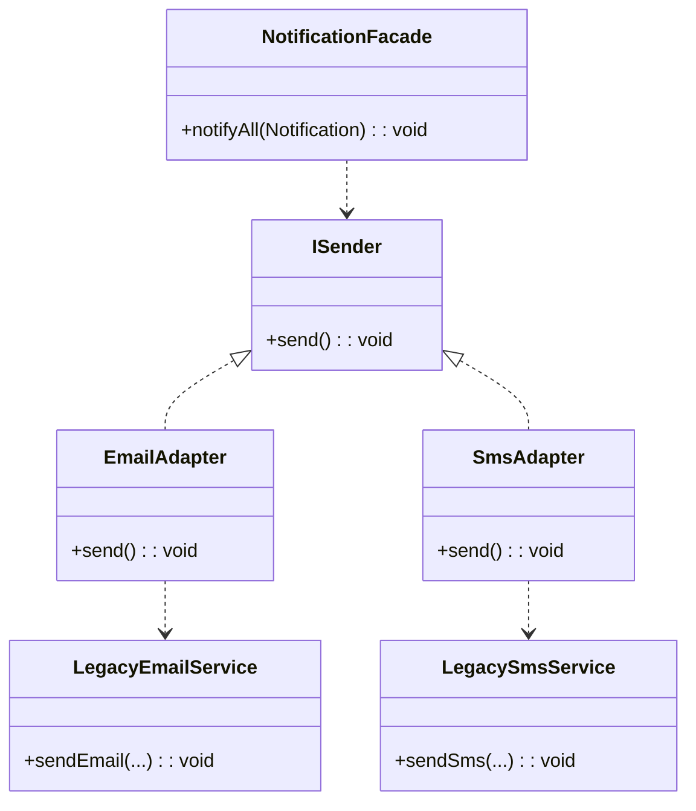

```mermaid
classDiagram
    class ISender {
        +send(): void
    }
    class LegacyEmailService {
        +sendEmail(...): void
    }
    class LegacySmsService {
        +sendSms(...): void
    }
    class EmailAdapter {
        +send(): void
    }
    class SmsAdapter {
        +send(): void
    }
    class NotificationFacade {
        +notifyAll(Notification): void
    }

    ISender <|.. EmailAdapter
    ISender <|.. SmsAdapter
    EmailAdapter ..> LegacyEmailService
    SmsAdapter ..> LegacySmsService
    NotificationFacade ..> ISender
```
