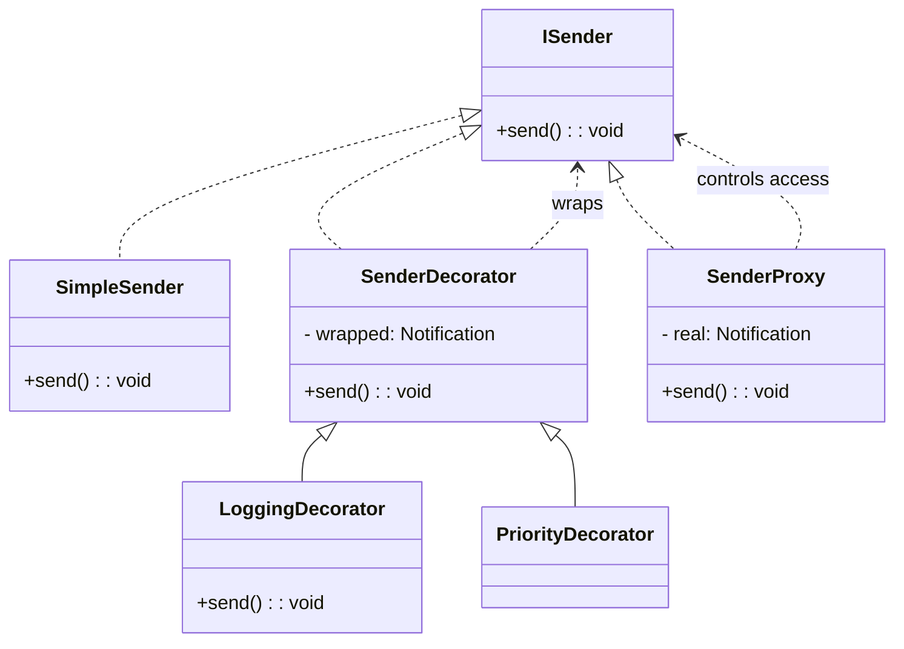

```mermaid
classDiagram
    class ISender {
        +send(): void
    }
    class SimpleSender {
        +send(): void
    }
    class SenderDecorator {
        - wrapped: Notification
        +send(): void
    }
    class LoggingDecorator {
        +send(): void
    }
    class SenderProxy {
        - real: Notification
        +send(): void
    }

    ISender <|.. SimpleSender
    ISender <|.. SenderDecorator
    SenderDecorator <|-- LoggingDecorator
    SenderDecorator <|-- PriorityDecorator
    ISender <|.. SenderProxy
    SenderProxy ..> ISender : controls access
    SenderDecorator ..> ISender : wraps
```
