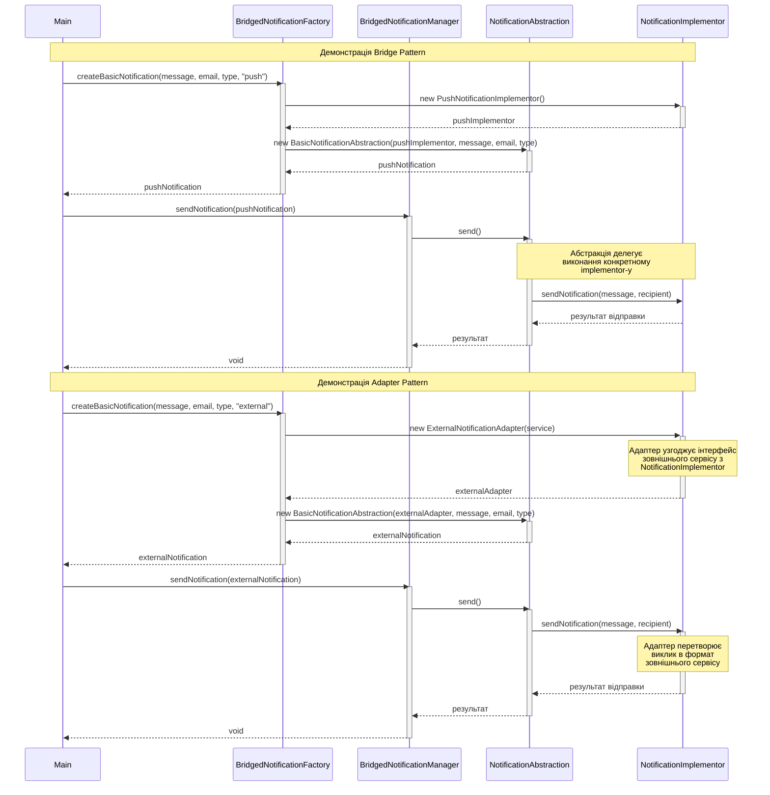

```mermaid
sequenceDiagram
    participant Main
    participant BridgedNotificationFactory
    participant BridgedNotificationManager
    participant NotificationAbstraction
    participant NotificationImplementor
    
    %% Bridge Pattern
    Note over Main,NotificationImplementor: Демонстрація Bridge Pattern
    Main->>BridgedNotificationFactory: createBasicNotification(message, email, type, "push")
    activate BridgedNotificationFactory
    BridgedNotificationFactory->>+NotificationImplementor: new PushNotificationImplementor()
    NotificationImplementor-->>-BridgedNotificationFactory: pushImplementor
    BridgedNotificationFactory->>+NotificationAbstraction: new BasicNotificationAbstraction(pushImplementor, message, email, type)
    NotificationAbstraction-->>-BridgedNotificationFactory: pushNotification
    BridgedNotificationFactory-->>Main: pushNotification
    deactivate BridgedNotificationFactory
    
    Main->>BridgedNotificationManager: sendNotification(pushNotification)
    activate BridgedNotificationManager
    BridgedNotificationManager->>NotificationAbstraction: send()
    activate NotificationAbstraction
    Note over NotificationAbstraction,NotificationImplementor: Абстракція делегує<br>виконання конкретному<br>implementor-у
    NotificationAbstraction->>NotificationImplementor: sendNotification(message, recipient)
    NotificationImplementor-->>NotificationAbstraction: результат відправки
    NotificationAbstraction-->>BridgedNotificationManager: результат
    deactivate NotificationAbstraction
    BridgedNotificationManager-->>Main: void
    deactivate BridgedNotificationManager
    
    %% Adapter Pattern
    Note over Main,NotificationImplementor: Демонстрація Adapter Pattern
    Main->>BridgedNotificationFactory: createBasicNotification(message, email, type, "external")
    activate BridgedNotificationFactory
    BridgedNotificationFactory->>+NotificationImplementor: new ExternalNotificationAdapter(service)
    Note over NotificationImplementor: Адаптер узгоджує інтерфейс<br>зовнішнього сервісу з<br>NotificationImplementor
    NotificationImplementor-->>-BridgedNotificationFactory: externalAdapter
    BridgedNotificationFactory->>+NotificationAbstraction: new BasicNotificationAbstraction(externalAdapter, message, email, type)
    NotificationAbstraction-->>-BridgedNotificationFactory: externalNotification
    BridgedNotificationFactory-->>Main: externalNotification
    deactivate BridgedNotificationFactory
    
    Main->>BridgedNotificationManager: sendNotification(externalNotification)
    activate BridgedNotificationManager
    BridgedNotificationManager->>NotificationAbstraction: send()
    activate NotificationAbstraction
    NotificationAbstraction->>NotificationImplementor: sendNotification(message, recipient)
    activate NotificationImplementor
    Note over NotificationImplementor: Адаптер перетворює<br>виклик в формат<br>зовнішнього сервісу
    NotificationImplementor-->>NotificationAbstraction: результат відправки
    deactivate NotificationImplementor
    NotificationAbstraction-->>BridgedNotificationManager: результат
    deactivate NotificationAbstraction
    BridgedNotificationManager-->>Main: void
    deactivate BridgedNotificationManager
```