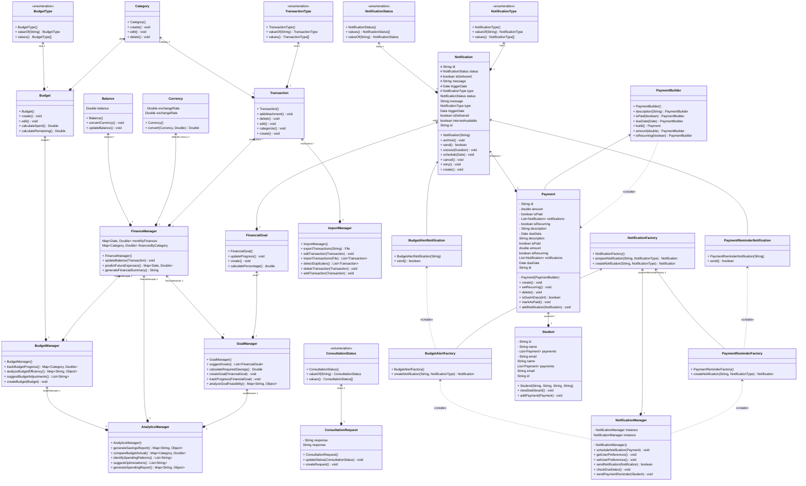

```mermaid
    classDiagram
    direction BT
    class AnalyticsManager {
        + AnalyticsManager()
        + generateSavingsReport() Map~String, Object~
        + compareBudgetActual() Map~Category, Double~
        + identifySpendingPatterns() List~String~
        + suggestOptimizations() List~String~
        + generateSpendingReport() Map~String, Object~
    }
    class Balance {
        + Balance()
        + convertCurrency() void
        + updateBalance() void
        Double balance
    }
    class Budget {
        + Budget()
        + create() void
        + edit() void
        + calculateSpent() Double
        + calculateRemaining() Double
    }
    class BudgetAlertFactory {
        + BudgetAlertFactory()
        + createNotification(String, NotificationType) Notification
    }
    class BudgetAlertNotification {
        + BudgetAlertNotification(String)
        + send() boolean
    }
    class BudgetManager {
        + BudgetManager()
        + trackBudgetProgress() Map~Category, Double~
        + analyzeBudgetEfficiency() Map~String, Object~
        + suggestBudgetAdjustments() List~String~
        + createBudget(Budget) void
    }
    class BudgetType {
        <<enumeration>>
        + BudgetType()
        + valueOf(String) BudgetType
        + values() BudgetType[]
    }
    class Category {
        + Category()
        + create() void
        + edit() void
        + delete() void
    }
    class ConsultationRequest {
        + ConsultationRequest()
        - String response
        + updateStatus(ConsultationStatus) void
        + createRequest() void
        String response
    }
    class ConsultationStatus {
        <<enumeration>>
        + ConsultationStatus()
        + valueOf(String) ConsultationStatus
        + values() ConsultationStatus[]
    }
    class Currency {
        + Currency()
        - Double exchangeRate
        + convert(Currency, Double) Double
        Double exchangeRate
    }
    class FinanceManager {
        + FinanceManager()
        + updateBalance(Transaction) void
        + predictFutureExpenses() Map~Date, Double~
        + generateFinancialSummary() String
        Map~Date, Double~ monthlyFinances
        Map~Category, Double~ financesByCategory
    }
    class FinancialGoal {
        + FinancialGoal()
        + updateProgress() void
        + create() void
        + calculatePercentage() double
    }
    class GoalManager {
        + GoalManager()
        + suggestGoals() List~FinancialGoal~
        + calculateRequiredSavings() Double
        + createGoal(FinancialGoal) void
        + trackProgress(FinancialGoal) void
        + analyzeGoalFeasibility() Map~String, Object~
    }
    class ImportManager {
        + ImportManager()
        + exportTransactions(String) File
        + editTransaction(Transaction) void
        + importTransactions(File) List~Transaction~
        + detectDuplicates() List~Transaction~
        + deleteTransaction(Transaction) void
        + addTransaction(Transaction) void
    }
    class Notification {
        + Notification(String)
        # String id
        # NotificationStatus status
        # boolean isDelivered
        # String message
        # Date triggerDate
        # NotificationType type
        + archive() void
        + send() boolean
        + snooze(Duration) void
        + schedule(Date) void
        + cancel() void
        + retry() void
        + create() void
        NotificationStatus status
        String message
        NotificationType type
        Date triggerDate
        boolean isDelivered
        boolean internetAvailable
        String id
    }
    class NotificationFactory {
        + NotificationFactory()
        + prepareNotification(String, NotificationType) Notification
        + createNotification(String, NotificationType) Notification
    }
    class NotificationManager {
        - NotificationManager()
        - NotificationManager instance
        + scheduleNotification(Payment) void
        + getUserPreferences() void
        + setUserPreferences() void
        + sendNotification(Notification) boolean
        + checkDueDates() void
        + sendPaymentReminder(Student) void
        NotificationManager instance
    }
    class NotificationStatus {
        <<enumeration>>
        + NotificationStatus()
        + values() NotificationStatus[]
        + valueOf(String) NotificationStatus
    }
    class NotificationType {
        <<enumeration>>
        + NotificationType()
        + valueOf(String) NotificationType
        + values() NotificationType[]
    }
    class Payment {
        - Payment(PaymentBuilder)
        - String id
        - double amount
        - boolean isPaid
        - List~Notification~ notifications
        - boolean isRecurring
        - String description
        - Date dueDate
        + create() void
        + setRecurring() void
        + delete() void
        + isDueInDays(int) boolean
        + markAsPaid() void
        + addNotification(Notification) void
        String description
        boolean isPaid
        double amount
        boolean isRecurring
        List~Notification~ notifications
        Date dueDate
        String id
    }
    class PaymentBuilder {
        + PaymentBuilder()
        + description(String) PaymentBuilder
        + isPaid(boolean) PaymentBuilder
        + dueDate(Date) PaymentBuilder
        + build() Payment
        + amount(double) PaymentBuilder
        + isRecurring(boolean) PaymentBuilder
    }
    class PaymentReminderFactory {
        + PaymentReminderFactory()
        + createNotification(String, NotificationType) Notification
    }
    class PaymentReminderNotification {
        + PaymentReminderNotification(String)
        + send() boolean
    }
    class Student {
        + Student(String, String, String, String)
        - String id
        - String name
        - List~Payment~ payments
        - String email
        + viewDashboard() void
        + addPayment(Payment) void
        String name
        List~Payment~ payments
        String email
        String id
    }
    class Transaction {
        + Transaction()
        + addAttachment() void
        + delete() void
        + edit() void
        + categorize() void
        + create() void
    }
    class TransactionType {
        <<enumeration>>
        + TransactionType()
        + valueOf(String) TransactionType
        + values() TransactionType[]
    }

    AnalyticsManager "1" *--> "budgetManager 1" BudgetManager
    AnalyticsManager "1" *--> "financeManager 1" FinanceManager
    AnalyticsManager "1" *--> "goalManager 1" GoalManager
    Budget "1" *--> "type 1" BudgetType
    Budget "1" *--> "allocations *" Category
    BudgetAlertFactory  ..>  BudgetAlertNotification : «create»
    BudgetAlertFactory  -->  NotificationFactory
    BudgetAlertNotification  -->  Notification
    BudgetManager "1" *--> "budgets *" Budget
    BudgetManager "1" *--> "financeManager 1" FinanceManager
    ConsultationRequest "1" *--> "status 1" ConsultationStatus
    FinanceManager "1" *--> "balances *" Balance
    FinanceManager "1" *--> "defaultCurrency 1" Currency
    FinanceManager "1" *--> "transactions *" Transaction
    FinancialGoal "1" *--> "notifications *" Notification
    GoalManager "1" *--> "financeManager 1" FinanceManager
    GoalManager "1" *--> "goals *" FinancialGoal
    ImportManager "1" *--> "transactions *" Transaction
    Notification "1" *--> "status 1" NotificationStatus
    Notification "1" *--> "type 1" NotificationType
    NotificationManager  ..>  BudgetAlertFactory : «create»
    NotificationManager "1" *--> "paymentReminderFactory 1" NotificationFactory
    NotificationManager  ..>  PaymentReminderFactory : «create»
    Payment "1" *--> "notifications *" Notification
    Payment  -->  PaymentBuilder
    PaymentBuilder  ..>  Payment : «create»
    PaymentReminderFactory  -->  NotificationFactory
    PaymentReminderFactory  ..>  PaymentReminderNotification : «create»
    PaymentReminderNotification  -->  Notification
    Student "1" *--> "payments *" Payment
    Transaction "1" *--> "category 1" Category
    Transaction "1" *--> "type 1" TransactionType

```