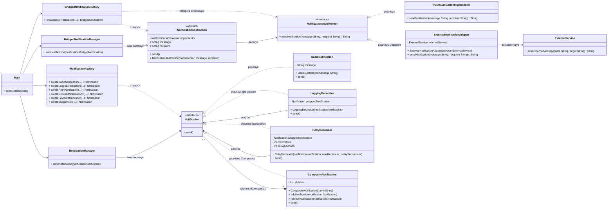

```mermaid
classDiagram
    direction LR

    class Main {
        + sendNotifications()
    }

    class BridgedNotificationFactory {
        + createBasicNotification(...) BridgedNotification
    }

    class BridgedNotificationManager {
        + sendNotification(notification BridgedNotification)
    }

    class NotificationAbstraction {
        <<Abstract>>
        - NotificationImplementor implementor
        # String message
        # String recipient

        + send()
        + NotificationAbstraction(implementor, message, recipient)
    }

    class NotificationImplementor {
        <<Interface>>
        + sendNotification(message String, recipient String) String
    }

    class PushNotificationImplementor {
        + sendNotification(message String, recipient String) String
    }

    class ExternalNotificationAdapter {
        - ExternalService externalService
        + ExternalNotificationAdapter(service ExternalService)
        + sendNotification(message String, recipient String) String
    }

    class ExternalService {
        + sendExternalMessage(data String, target String) String
    }

    class Notification {
        <<Interface>>
        + send()
    }

    class NotificationFactory {
        + createBasicNotification(...) Notification
        + createLoggedNotification(...) Notification
        + createRetryNotification(...) Notification
        + createGroupedNotifications(...) Notification
        + createPaymentReminder(...) Notification
        + createBudgetAlert(...) Notification
    }

    class NotificationManager {
        + sendNotification(notification Notification)
    }

    class BasicNotification {
        - String message
        + BasicNotification(message String)
        + send()
    }

    class LoggingDecorator {
        - Notification wrappedNotification
        + LoggingDecorator(notification Notification)
        + send()
    }

    class RetryDecorator {
        - Notification wrappedNotification
        - int maxRetries
        - int delaySeconds
        + RetryDecorator(notification Notification, maxRetries int, delaySeconds int)
        + send()
    }

    class CompositeNotification {
        - List<Notification> children
        + CompositeNotification(name String)
        + addNotification(notification Notification)
        + removeNotification(notification Notification)
        + send()
    }

%% Relationships

    Main --> BridgedNotificationFactory
    Main --> BridgedNotificationManager
    Main --> NotificationFactory
    Main --> NotificationManager

    BridgedNotificationFactory ..> NotificationAbstraction : створює
    BridgedNotificationFactory ..> NotificationImplementor : створює реалізацію

    BridgedNotificationManager --> NotificationAbstraction : використовує

    NotificationAbstraction --> NotificationImplementor : делегує

    NotificationImplementor <|.. PushNotificationImplementor : реалізує

    NotificationImplementor <|.. ExternalNotificationAdapter : реалізує (Adapter)
    ExternalNotificationAdapter --> ExternalService : використовує

    NotificationFactory ..> Notification : створює

    NotificationManager --> Notification : використовує

    Notification <|.. BasicNotification : реалізує

    Notification <|.. LoggingDecorator : реалізує (Decorator)
    LoggingDecorator --> Notification : огортає

    Notification <|.. RetryDecorator : реалізує (Decorator)
    RetryDecorator --> Notification : огортає

    Notification <|.. CompositeNotification : реалізує (Composite)
    CompositeNotification "1" *-- "0..*" Notification : містить (Композиція)
```