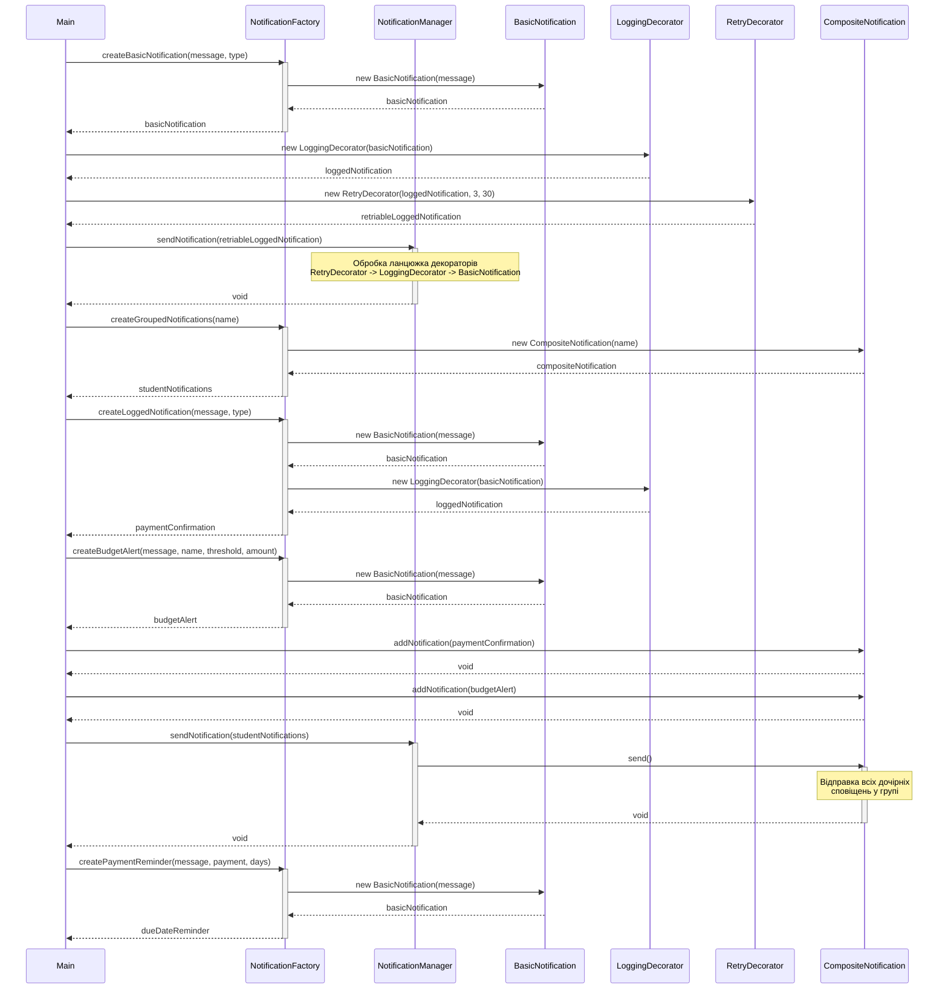

```mermaid
sequenceDiagram
    participant Main
    participant NotificationFactory
    participant NotificationManager
    participant BasicNotification
    participant LoggingDecorator
    participant RetryDecorator
    participant CompositeNotification
    
    %% Decorator Pattern
    Main->>NotificationFactory: createBasicNotification(message, type)
    activate NotificationFactory
    NotificationFactory->>BasicNotification: new BasicNotification(message)
    BasicNotification-->>NotificationFactory: basicNotification
    NotificationFactory-->>Main: basicNotification
    deactivate NotificationFactory
    
    Main->>LoggingDecorator: new LoggingDecorator(basicNotification)
    LoggingDecorator-->>Main: loggedNotification
    
    Main->>RetryDecorator: new RetryDecorator(loggedNotification, 3, 30)
    RetryDecorator-->>Main: retriableLoggedNotification
    
    Main->>NotificationManager: sendNotification(retriableLoggedNotification)
    activate NotificationManager
    Note over NotificationManager: Обробка ланцюжка декораторів<br>RetryDecorator -> LoggingDecorator -> BasicNotification
    NotificationManager-->>Main: void
    deactivate NotificationManager
    
    %% Composite Pattern
    Main->>NotificationFactory: createGroupedNotifications(name)
    activate NotificationFactory
    NotificationFactory->>CompositeNotification: new CompositeNotification(name)
    CompositeNotification-->>NotificationFactory: compositeNotification
    NotificationFactory-->>Main: studentNotifications
    deactivate NotificationFactory
    
    Main->>NotificationFactory: createLoggedNotification(message, type)
    activate NotificationFactory
    NotificationFactory->>BasicNotification: new BasicNotification(message)
    BasicNotification-->>NotificationFactory: basicNotification
    NotificationFactory->>LoggingDecorator: new LoggingDecorator(basicNotification)
    LoggingDecorator-->>NotificationFactory: loggedNotification
    NotificationFactory-->>Main: paymentConfirmation
    deactivate NotificationFactory
    
    Main->>NotificationFactory: createBudgetAlert(message, name, threshold, amount)
    activate NotificationFactory
    NotificationFactory->>BasicNotification: new BasicNotification(message)
    BasicNotification-->>NotificationFactory: basicNotification
    NotificationFactory-->>Main: budgetAlert
    deactivate NotificationFactory
    
    Main->>CompositeNotification: addNotification(paymentConfirmation)
    CompositeNotification-->>Main: void
    
    Main->>CompositeNotification: addNotification(budgetAlert)
    CompositeNotification-->>Main: void
    
    Main->>NotificationManager: sendNotification(studentNotifications)
    activate NotificationManager
    NotificationManager->>CompositeNotification: send()
    activate CompositeNotification
    Note over CompositeNotification: Відправка всіх дочірніх<br>сповіщень у групі
    CompositeNotification-->>NotificationManager: void
    deactivate CompositeNotification
    NotificationManager-->>Main: void
    deactivate NotificationManager
    
    %% Factory Method
    Main->>NotificationFactory: createPaymentReminder(message, payment, days)
    activate NotificationFactory
    NotificationFactory->>BasicNotification: new BasicNotification(message)
    BasicNotification-->>NotificationFactory: basicNotification
    NotificationFactory-->>Main: dueDateReminder
    deactivate NotificationFactory
```