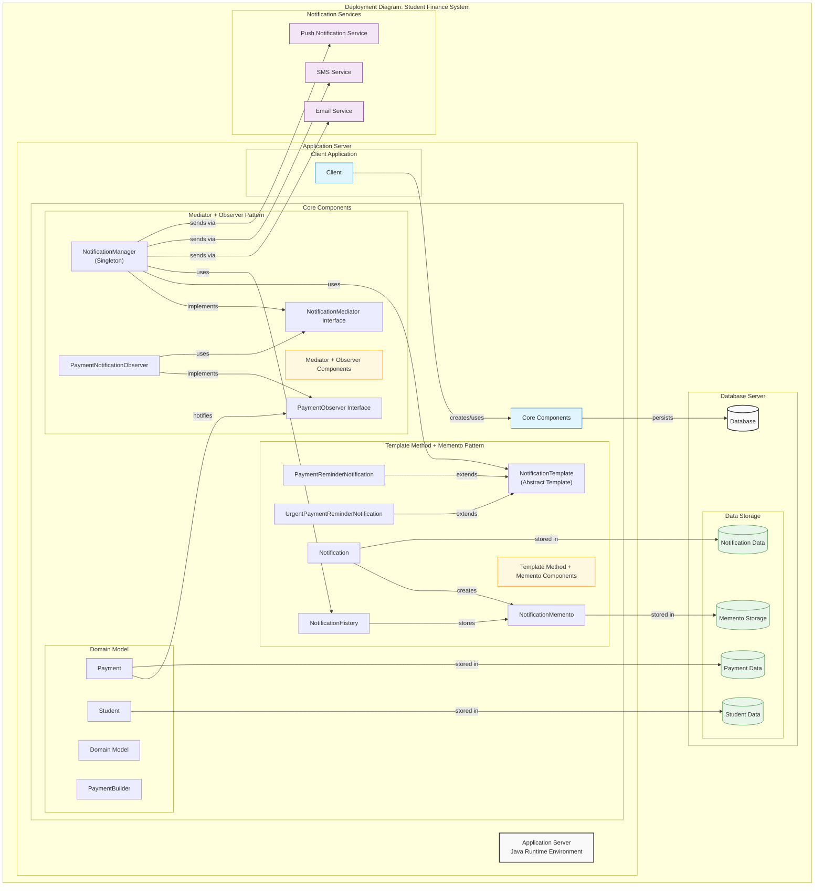

```mermaid
flowchart TD
    subgraph "Deployment Diagram: Student Finance System"
        subgraph "Application Server"
            AppServer["Application Server\nJava Runtime Environment"]
            
            subgraph "Core Components"
                CoreComp["Core Components"]
                
                subgraph "Domain Model"
                    DM["Domain Model"]
                    Student["Student"]
                    Payment["Payment"]
                    PaymentBuilder["PaymentBuilder"]
                end
                
                subgraph "Mediator + Observer Pattern"
                    MO["Mediator + Observer Components"]
                    NotificationMediator["NotificationMediator Interface"]
                    NotificationManager["NotificationManager\n(Singleton)"]
                    PaymentObserver["PaymentObserver Interface"]
                    PaymentNotificationObserver["PaymentNotificationObserver"]
                end
                
                subgraph "Template Method + Memento Pattern"
                    TM["Template Method + Memento Components"]
                    NotificationTemplate["NotificationTemplate\n(Abstract Template)"]
                    PaymentReminderNotification["PaymentReminderNotification"]
                    UrgentPaymentReminderNotification["UrgentPaymentReminderNotification"]
                    Notification["Notification"]
                    NotificationMemento["NotificationMemento"]
                    NotificationHistory["NotificationHistory"]
                end
            end
            
            subgraph "Client Application"
                Client["Client"]
            end
        end
        
        subgraph "Database Server"
            DB[(Database)]
            subgraph "Data Storage"
                StudentDB[("Student Data")]
                PaymentDB[("Payment Data")]
                NotificationDB[("Notification Data")]
                MementoDB[("Memento Storage")]
            end
        end
        
        subgraph "Notification Services"
            EmailService["Email Service"]
            SMSService["SMS Service"]
            PushService["Push Notification Service"]
        end
        
        %% Connections between components
        Client -- "creates/uses" --> CoreComp
        CoreComp -- "persists" --> DB
        
        %% Mediator + Observer connections
        NotificationManager -- "implements" --> NotificationMediator
        PaymentNotificationObserver -- "implements" --> PaymentObserver
        Payment -- "notifies" --> PaymentObserver
        PaymentNotificationObserver -- "uses" --> NotificationMediator
        
        %% Template Method + Memento connections
        PaymentReminderNotification -- "extends" --> NotificationTemplate
        UrgentPaymentReminderNotification -- "extends" --> NotificationTemplate
        Notification -- "creates" --> NotificationMemento
        NotificationHistory -- "stores" --> NotificationMemento
        NotificationManager -- "uses" --> NotificationTemplate
        NotificationManager -- "uses" --> NotificationHistory
        
        %% External service connections
        NotificationManager -- "sends via" --> EmailService
        NotificationManager -- "sends via" --> SMSService
        NotificationManager -- "sends via" --> PushService
        
        %% Database connections
        Student -- "stored in" --> StudentDB
        Payment -- "stored in" --> PaymentDB
        Notification -- "stored in" --> NotificationDB
        NotificationMemento -- "stored in" --> MementoDB
        
        %% Style definitions
        classDef server fill:#f9f9f9,stroke:#333,stroke-width:2px
        classDef component fill:#e1f5fe,stroke:#01579b,stroke-width:1px
        classDef patternGroup fill:#fff8e1,stroke:#ff8f00,stroke-width:1px
        classDef database fill:#e8f5e9,stroke:#2e7d32,stroke-width:1px
        classDef service fill:#f3e5f5,stroke:#7b1fa2,stroke-width:1px
        
        class AppServer,DB server
        class CoreComp,Client component
        class MO,TM patternGroup
        class StudentDB,PaymentDB,NotificationDB,MementoDB database
        class EmailService,SMSService,PushService service
    end
```