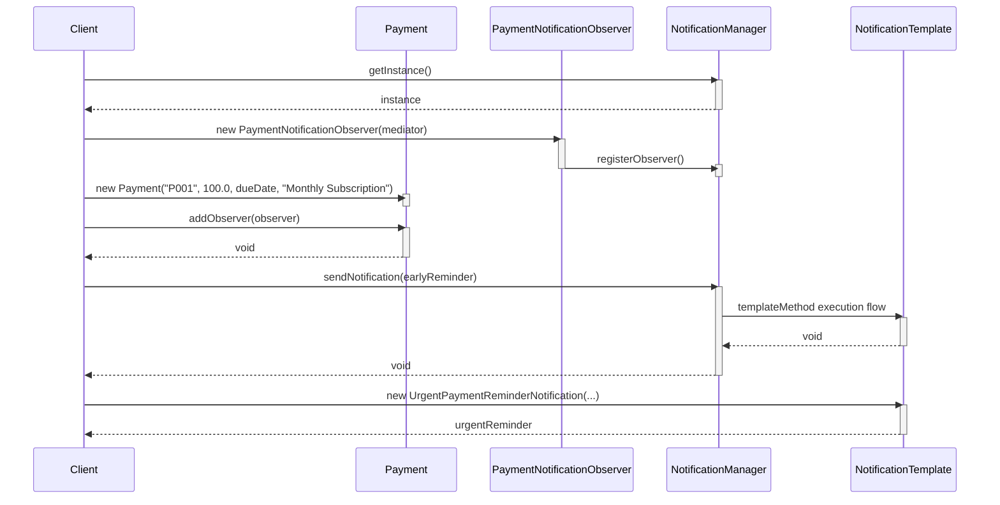

```mermaid

sequenceDiagram
    participant Client as Client
    participant Payment
    participant Observer as PaymentNotificationObserver
    participant NotificationManager
    participant NotificationTemplate

    Client->>NotificationManager: getInstance()
    activate NotificationManager
    NotificationManager-->>Client: instance
    deactivate NotificationManager

    Client->>Observer: new PaymentNotificationObserver(mediator)
    activate Observer
    Observer->>NotificationManager: registerObserver()
    activate NotificationManager
    deactivate NotificationManager
    deactivate Observer

    Client->>Payment: new Payment("P001", 100.0, dueDate, "Monthly Subscription")
    activate Payment
    deactivate Payment

    Client->>Payment: addObserver(observer)
    activate Payment
    Payment-->>Client: void
    deactivate Payment

    Client->>NotificationManager: sendNotification(earlyReminder)
    activate NotificationManager
    NotificationManager->>NotificationTemplate: templateMethod execution flow
    activate NotificationTemplate
    NotificationTemplate-->>NotificationManager: void
    deactivate NotificationTemplate
    NotificationManager-->>Client: void
    deactivate NotificationManager

    Client->>NotificationTemplate: new UrgentPaymentReminderNotification(...)
    activate NotificationTemplate
    NotificationTemplate-->>Client: urgentReminder
    deactivate NotificationTemplate


```