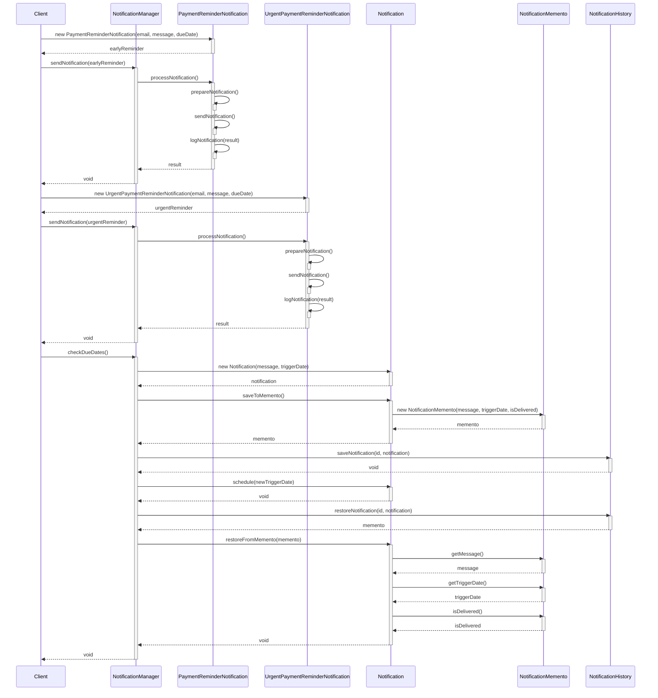

```mermaid
sequenceDiagram
    participant Client as Client
    participant NotificationManager
    participant PaymentReminderNotification
    participant UrgentPaymentReminderNotification
    participant Notification
    participant NotificationMemento
    participant NotificationHistory

    %% Template Method Pattern Demonstration
    Client->>PaymentReminderNotification: new PaymentReminderNotification(email, message, dueDate)
    activate PaymentReminderNotification
    PaymentReminderNotification-->>Client: earlyReminder
    deactivate PaymentReminderNotification

    Client->>NotificationManager: sendNotification(earlyReminder)
    activate NotificationManager
    NotificationManager->>PaymentReminderNotification: processNotification()
    activate PaymentReminderNotification
    
    %% Template Method Pattern Sequence
    PaymentReminderNotification->>PaymentReminderNotification: prepareNotification()
    activate PaymentReminderNotification
    deactivate PaymentReminderNotification
    
    PaymentReminderNotification->>PaymentReminderNotification: sendNotification()
    activate PaymentReminderNotification
    deactivate PaymentReminderNotification
    
    PaymentReminderNotification->>PaymentReminderNotification: logNotification(result)
    activate PaymentReminderNotification
    deactivate PaymentReminderNotification
    
    PaymentReminderNotification-->>NotificationManager: result
    deactivate PaymentReminderNotification
    NotificationManager-->>Client: void
    deactivate NotificationManager

    %% Template Method with Specialized Implementation
    Client->>UrgentPaymentReminderNotification: new UrgentPaymentReminderNotification(email, message, dueDate)
    activate UrgentPaymentReminderNotification
    UrgentPaymentReminderNotification-->>Client: urgentReminder
    deactivate UrgentPaymentReminderNotification

    Client->>NotificationManager: sendNotification(urgentReminder)
    activate NotificationManager
    NotificationManager->>UrgentPaymentReminderNotification: processNotification()
    activate UrgentPaymentReminderNotification
    
    %% Template Method Pattern Sequence (with overridden methods)
    UrgentPaymentReminderNotification->>UrgentPaymentReminderNotification: prepareNotification()
    activate UrgentPaymentReminderNotification
    deactivate UrgentPaymentReminderNotification
    
    UrgentPaymentReminderNotification->>UrgentPaymentReminderNotification: sendNotification()
    activate UrgentPaymentReminderNotification
    deactivate UrgentPaymentReminderNotification
    
    UrgentPaymentReminderNotification->>UrgentPaymentReminderNotification: logNotification(result)
    activate UrgentPaymentReminderNotification
    deactivate UrgentPaymentReminderNotification
    
    UrgentPaymentReminderNotification-->>NotificationManager: result
    deactivate UrgentPaymentReminderNotification
    NotificationManager-->>Client: void
    deactivate NotificationManager

    %% Memento Pattern Demonstration
    Client->>NotificationManager: checkDueDates()
    activate NotificationManager
    
    %% Creating and saving state with Memento
    NotificationManager->>Notification: new Notification(message, triggerDate)
    activate Notification
    Notification-->>NotificationManager: notification
    deactivate Notification
    
    NotificationManager->>Notification: saveToMemento()
    activate Notification
    Notification->>NotificationMemento: new NotificationMemento(message, triggerDate, isDelivered)
    activate NotificationMemento
    NotificationMemento-->>Notification: memento
    deactivate NotificationMemento
    Notification-->>NotificationManager: memento
    deactivate Notification
    
    NotificationManager->>NotificationHistory: saveNotification(id, notification)
    activate NotificationHistory
    NotificationHistory-->>NotificationManager: void
    deactivate NotificationHistory
    
    %% Modifying notification state
    NotificationManager->>Notification: schedule(newTriggerDate)
    activate Notification
    Notification-->>NotificationManager: void
    deactivate Notification
    
    %% Restoring state from Memento
    NotificationManager->>NotificationHistory: restoreNotification(id, notification)
    activate NotificationHistory
    NotificationHistory-->>NotificationManager: memento
    deactivate NotificationHistory
    
    NotificationManager->>Notification: restoreFromMemento(memento)
    activate Notification
    Notification->>NotificationMemento: getMessage()
    activate NotificationMemento
    NotificationMemento-->>Notification: message
    deactivate NotificationMemento
    
    Notification->>NotificationMemento: getTriggerDate()
    activate NotificationMemento
    NotificationMemento-->>Notification: triggerDate
    deactivate NotificationMemento
    
    Notification->>NotificationMemento: isDelivered()
    activate NotificationMemento
    NotificationMemento-->>Notification: isDelivered
    deactivate NotificationMemento
    
    Notification-->>NotificationManager: void
    deactivate Notification
    
    NotificationManager-->>Client: void
    deactivate NotificationManager
```