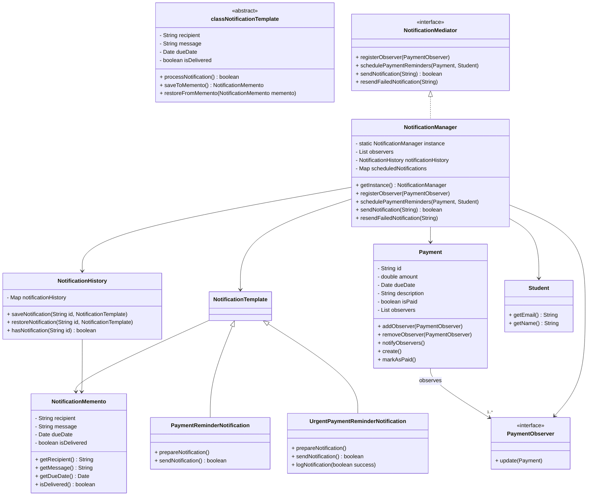

```mermaid
classDiagram

%% ==== TEMPLATE METHOD ====
class class NotificationTemplate {
    <<abstract>>
    - String recipient
    - String message
    - Date dueDate
    - boolean isDelivered
    + processNotification() boolean
    + saveToMemento() NotificationMemento
    + restoreFromMemento(NotificationMemento memento)
}

class PaymentReminderNotification {
    + prepareNotification()
    + sendNotification() boolean
}

class UrgentPaymentReminderNotification {
    + prepareNotification()
    + sendNotification() boolean
    + logNotification(boolean success)
}

NotificationTemplate <|-- PaymentReminderNotification
NotificationTemplate <|-- UrgentPaymentReminderNotification

%% ==== MEMENTO ====
class NotificationMemento {
    - String recipient
    - String message
    - Date dueDate
    - boolean isDelivered
    + getRecipient() String
    + getMessage() String
    + getDueDate() Date
    + isDelivered() boolean
}

class NotificationHistory {
    - Map<String, NotificationMemento> notificationHistory
    + saveNotification(String id, NotificationTemplate)
    + restoreNotification(String id, NotificationTemplate)
    + hasNotification(String id) boolean
}

%% ==== OBSERVER ====
class PaymentObserver {
    <<interface>>
    + update(Payment)
}

class Payment {
    - String id
    - double amount
    - Date dueDate
    - String description
    - boolean isPaid
    - List<PaymentObserver> observers
    + addObserver(PaymentObserver)
    + removeObserver(PaymentObserver)
    + notifyObservers()
    + create()
    + markAsPaid()
}

Payment --> "1..*" PaymentObserver : observes

%% ==== MEDIATOR ====
class NotificationMediator {
    <<interface>>
    + registerObserver(PaymentObserver)
    + schedulePaymentReminders(Payment, Student)
    + sendNotification(String) boolean
    + resendFailedNotification(String)
}

class NotificationManager {
    - static NotificationManager instance
    - List<PaymentObserver> observers
    - NotificationHistory notificationHistory
    - Map<String, NotificationTemplate> scheduledNotifications
    + getInstance() NotificationManager
    + registerObserver(PaymentObserver)
    + schedulePaymentReminders(Payment, Student)
    + sendNotification(String) boolean
    + resendFailedNotification(String)
}

NotificationMediator <|.. NotificationManager
NotificationManager --> NotificationHistory
NotificationManager --> NotificationTemplate
NotificationManager --> PaymentObserver

%% ==== STUDENT (helper class assumed) ====
class Student {
    + getEmail() String
    + getName() String
}

NotificationManager --> Student
NotificationManager --> Payment

%% ==== RELATIONS FOR MEMENTO ====
NotificationTemplate --> NotificationMemento
NotificationHistory --> NotificationMemento


```